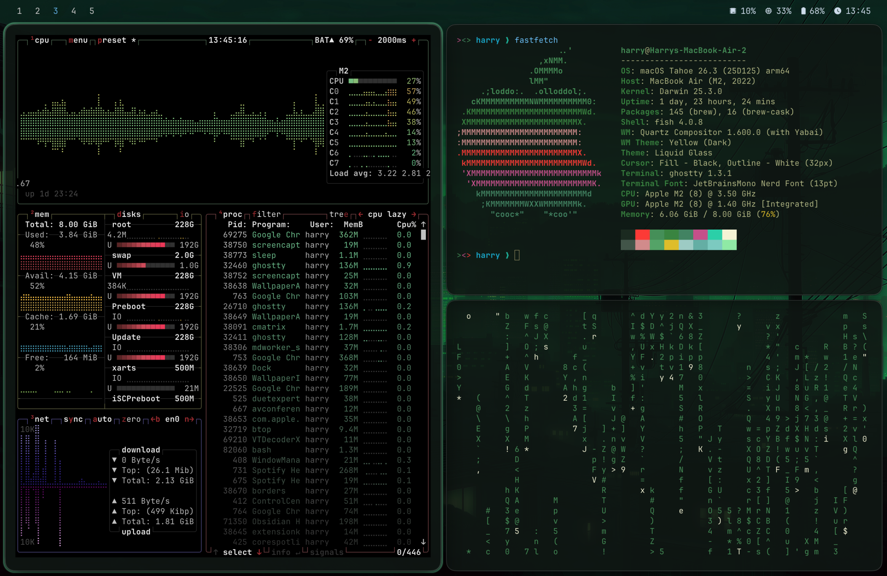

# Macarchy

Omarchy-inspired macOS dotfiles for a tiling, themed desktop built around `yabai`, `skhd`, `sketchybar`, `borders`, Ghostty, Raycast, and a theme-switching workflow.

## Preview





## What's included

- `home/.skhdrc`: hotkeys
- `home/.config/yabai`: tiling window manager config
- `home/.config/borders`: active window border config
- `home/.config/sketchybar`: top bar config and plugins
- `home/.config/ghostty`: terminal appearance config
- `home/.config/fish`: shell config
- `home/.config/fastfetch`: terminal summary config
- `home/.config/btop`: terminal monitor config
- `home/.config/neofetch`: terminal summary config
- `home/.config/nvim`: Neovim config
- `home/.config/raycast/extensions/theme-switcher`: custom Raycast theme and clipboard extension
- `home/.themes`: theme packs, wallpapers, Ghostty palettes
- `home/.local/bin/set-wallpaper`: wallpaper helper used by the theme switcher
- `home/.gitconfig`: Git defaults
- `home/.vimrc`: Vim defaults
- `library/LaunchAgents`: launch agents for `yabai`, `skhd`, `sketchybar`, and the Raycast clipboard watcher
- `Brewfile`: package manifest

## Install

Install Homebrew first, then run:

```bash
brew bundle --file Brewfile
```

This setup expects:

- `yabai`
- `skhd`
- `sketchybar`
- `borders`
- `jq`
- `ghostty`
- `raycast`
- `desktoppr`

## Copy onto a Mac

From inside this folder:

```bash
rsync -a home/ ~/
rsync -a library/LaunchAgents/ ~/Library/LaunchAgents/
```

This overlays the included files. It does not delete existing files.

## Manual setup

1. Check for any remaining machine-specific paths.

Most obvious username-specific paths were removed from the repo copy. Before loading this on another Mac, do a quick scan for anything host-specific that still needs adjustment:

```bash
rg -n '/Users/|/path/to/|com.harry' .
```

The most likely files to revisit are:

- `library/LaunchAgents/com.harry.raycast-clipboard-watcher.plist`
- `home/.config/fish/config.fish`

2. Give macOS permissions.

Enable Accessibility permissions for:

- `yabai`
- `skhd`
- `Raycast`
- `Ghostty` if you want the same automation and clipboard behavior

You may also need Automation permissions for:

- `Raycast`
- `System Events`
- `Finder`

3. Enable the `yabai` scripting addition if you want full behavior.

`home/.config/yabai/yabairc` contains:

```bash
sudo yabai --load-sa
```

That requires the standard `yabai` scripting-addition setup, including the related SIP changes on a fresh machine.

4. Load the launch agents.

```bash
launchctl bootstrap "gui/$(id -u)" ~/Library/LaunchAgents/com.asmvik.yabai.plist
launchctl bootstrap "gui/$(id -u)" ~/Library/LaunchAgents/com.koekeishiya.skhd.plist
launchctl bootstrap "gui/$(id -u)" ~/Library/LaunchAgents/homebrew.mxcl.sketchybar.plist
launchctl bootstrap "gui/$(id -u)" ~/Library/LaunchAgents/com.harry.raycast-clipboard-watcher.plist
```

If already loaded:

```bash
launchctl kickstart -k "gui/$(id -u)/com.asmvik.yabai"
launchctl kickstart -k "gui/$(id -u)/com.koekeishiya.skhd"
launchctl kickstart -k "gui/$(id -u)/homebrew.mxcl.sketchybar"
launchctl kickstart -k "gui/$(id -u)/com.harry.raycast-clipboard-watcher"
```

5. Re-import Raycast manually.

This cleaned repo includes the custom extension source, but not a full Raycast preference export. Reconfigure these manually:

- Raycast global hotkey
- command permissions
- extension enablement
- clipboard history access

6. Export Shortcuts separately if needed.

Shortcuts were intentionally left out of this repo. If you want them on another machine, export the important shortcuts individually from the Shortcuts app and import them there.

## What drives the look

- Window management: `yabai` + `skhd`
- Active window border: `borders`
- Top bar: `sketchybar`
- Terminal appearance: Ghostty + `home/.themes/*/ghostty.conf`
- Shell and terminal extras: `fish`, `fastfetch`, `btop`, `neofetch`
- Wallpapers and theme switching: Raycast `theme-switcher` + `home/.themes`
- Current theme selector: `home/.themes/.current`

## Notes

- The top bar is a transparent `sketchybar` layout with spaces on the left and status items on the right.
- `cmd + shift + space` toggles the top bar.
- `cmd + ctrl + space` opens the Raycast theme switcher command.
- `cmd + v` in Ghostty is intercepted by the Raycast clipboard helper.
