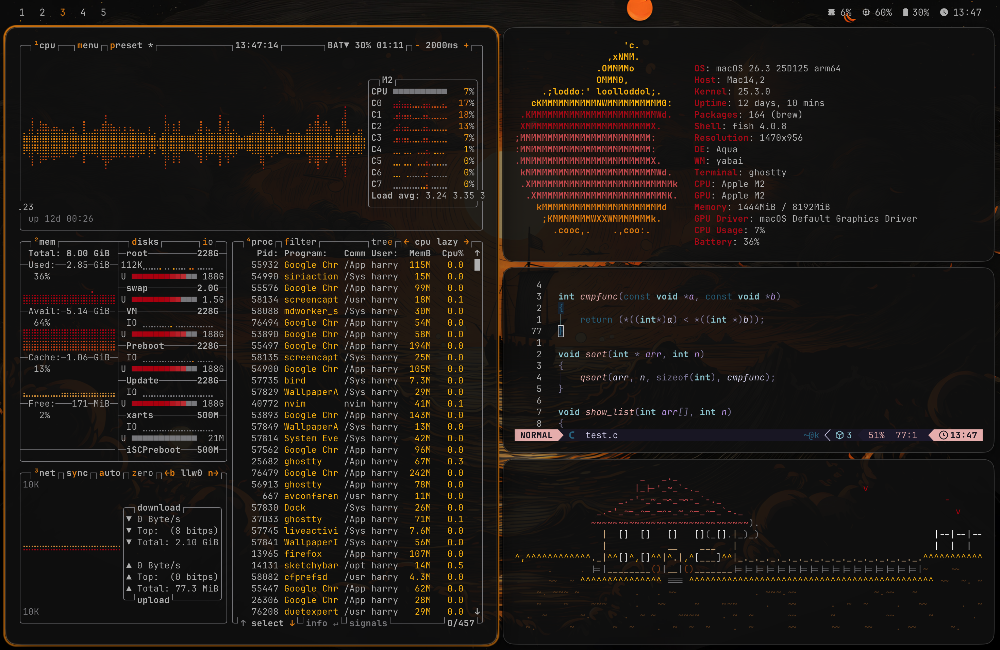
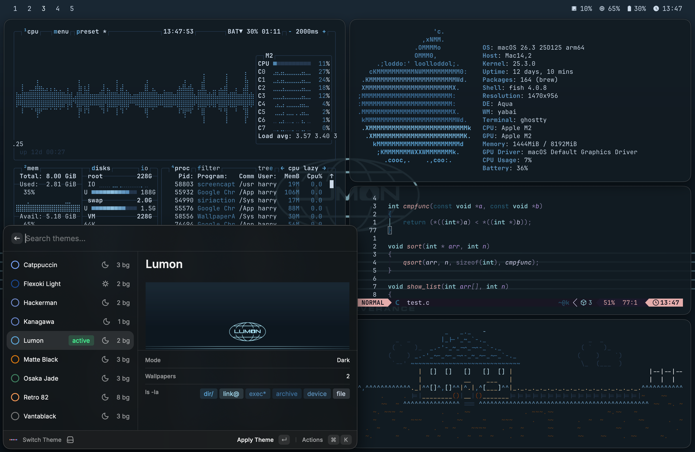

# Macarchy

Opinionated macOS dotfiles for a themed tiling desktop built around `yabai`, `skhd`, `sketchybar`, Ghostty, Raycast, Neovim, and a fast theme-switching workflow.

The goal is simple: one command changes the wallpaper, terminal palette, Neovim theme, `btop` colors, SketchyBar accent, Raycast appearance, and window border accent so the whole desktop moves together.

## Preview







## What You Get

- A `yabai` + `skhd` tiling workflow with launch agents.
- Per-app floating window persistence helpers for `yabai`.
- Transparent SketchyBar with theme-driven colors.
- Per-theme Ghostty palettes and wallpapers in [`home/.themes`](home/.themes).
- Theme-aware Neovim switching via [`home/.local/bin/theme-switch`](home/.local/bin/theme-switch).
- Transparent Neovim backgrounds that let the terminal theme show through.
- Theme-aware `btop` colors with automatic live reload.
- Bundled Raycast extension source for theme switching and clipboard helpers.
- A repo layout that mirrors `$HOME`, so install and maintenance stay straightforward.

## Quick Start

1. Install Xcode Command Line Tools if you do not already have them:

```bash
xcode-select --install
```

2. Install Homebrew.

3. From this repo, run:

```bash
bash ./install.sh
```

That will:

- install the packages in [`Brewfile`](Brewfile)
- copy `home/` into your home directory
- copy launch agents into `~/Library/LaunchAgents`

## Manual Install

If you want to do it by hand:

```bash
brew bundle --file Brewfile
rsync -a home/ ~/
mkdir -p ~/Library/LaunchAgents
rsync -a library/LaunchAgents/ ~/Library/LaunchAgents/
```

This is an overlay. It does not delete existing files.

## Post-Install

1. Grant Accessibility permissions to:

- `yabai`
- `skhd`
- `Raycast`
- `Ghostty` if you want the same automation behavior

2. Grant Automation permissions where prompted for:

- `Raycast`
- `System Events`
- `Finder`

3. If you use the `yabai` scripting addition, make sure it is configured correctly for your machine. The repo ships a config that expects:

```bash
sudo yabai --load-sa
```

4. Load the launch agents:

```bash
launchctl bootstrap "gui/$(id -u)" ~/Library/LaunchAgents/com.asmvik.yabai.plist
launchctl bootstrap "gui/$(id -u)" ~/Library/LaunchAgents/com.koekeishiya.skhd.plist
launchctl bootstrap "gui/$(id -u)" ~/Library/LaunchAgents/homebrew.mxcl.sketchybar.plist
launchctl bootstrap "gui/$(id -u)" ~/Library/LaunchAgents/dev.macarchy.raycast-clipboard-watcher.plist
```

If they already exist:

```bash
launchctl kickstart -k "gui/$(id -u)/com.asmvik.yabai"
launchctl kickstart -k "gui/$(id -u)/com.koekeishiya.skhd"
launchctl kickstart -k "gui/$(id -u)/homebrew.mxcl.sketchybar"
launchctl kickstart -k "gui/$(id -u)/dev.macarchy.raycast-clipboard-watcher"
```

## Apple Silicon SIP Setup

If you use the `yabai` scripting addition on Apple Silicon and the boot arg does not stick, `--without nvram` is sometimes not enough on its own because boot-arg restrictions can still block it.

If that happens, this sequence is the practical fallback:

1. In Recovery Terminal:

```bash
csrutil disable
```

2. Reboot into normal macOS, then run:

```bash
sudo nvram boot-args=-arm64e_preview_abi
```

3. Boot back into Recovery, then run:

```bash
csrutil enable --without fs --without debug --without nvram
```

4. Reboot normally.

That keeps SIP mostly enabled while still allowing the boot arg to persist.

## Theme System

Themes live in [`home/.themes`](home/.themes). Each theme directory contains:

- `ghostty.conf` for terminal colors
- `theme.env` for theme metadata and accent values
- `wall.*` for the main wallpaper
- optional `backgrounds/` variants

The active theme marker is [`home/.themes/.current`](home/.themes/.current).

The main switcher is [`home/.local/bin/theme-switch`](home/.local/bin/theme-switch). It updates:

- Ghostty colors
- SketchyBar colors
- Neovim colorscheme
- `btop` theme
- Raycast appearance
- border accent color
- wallpaper

Runtime-generated files are part of the normal flow:

- `~/.config/sketchybar/theme.sh`
- `~/.config/btop/themes/active-theme.theme`
- `~/.config/nvim/lua/plugins/colorscheme.lua`

## Machine-Specific Bits

Most of the repo is portable now, but a few integrations are intentionally optional:

- The Raycast-specific bindings in [`home/.skhdrc`](home/.skhdrc) assume you use Raycast, but they no longer hardcode your local home path.
- The clipboard watcher launch agent is genericized, but it still expects the Raycast helper script to exist under `~/.config/raycast/extensions/theme-switcher/`.
- If you use a different Raycast workflow, those bindings are safe to edit or remove.

## Repo Layout

- [`Brewfile`](Brewfile): package manifest
- [`install.sh`](install.sh): one-command install helper
- [`home/.config/yabai`](home/.config/yabai): window manager config and helper scripts
- [`home/.config/sketchybar`](home/.config/sketchybar): top bar config and plugins
- [`home/.config/ghostty`](home/.config/ghostty): terminal config
- [`home/.config/nvim`](home/.config/nvim): LazyVim-based Neovim config
- [`home/.config/raycast/extensions/theme-switcher`](home/.config/raycast/extensions/theme-switcher): local Raycast extension source
- [`home/.config/btop`](home/.config/btop): system monitor config
- [`home/.local/bin`](home/.local/bin): local helper scripts
- [`library/LaunchAgents`](library/LaunchAgents): launch agents for startup services

## Notes

- The repo defaults to the current active theme in [`home/.themes/.current`](home/.themes/.current).
- `btop` stays transparent and receives a generated per-theme palette at switch time.
- Neovim is configured to clear common background highlight groups so the terminal background shows through cleanly.
- The Raycast extension source is bundled here, but you still need to enable or develop-load it in Raycast if you want the optional helper commands.

## License

This project is released under the MIT License. See [`LICENSE`](LICENSE).
