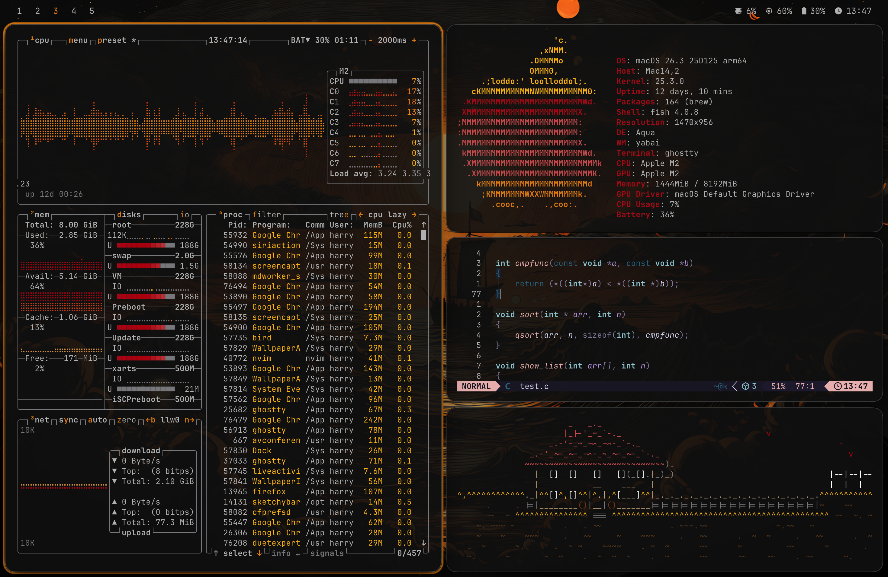
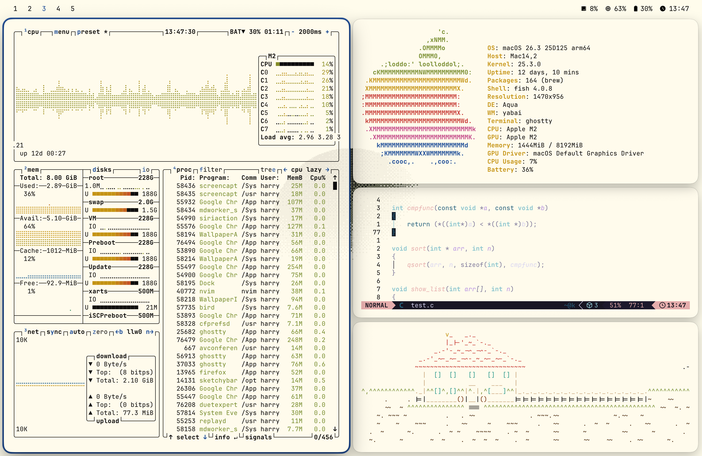

# Macarchy

Macarchy is my personal macOS setup: a themed tiling desktop built around `yabai`, `skhd`, SketchyBar, Ghostty, Raycast, Neovim, `btop`, and a small set of local helper scripts.

The main workflow is theme switching. One command applies the wallpaper, Ghostty palette, Neovim colorscheme, `btop` colors, SketchyBar colors, Raycast appearance, and window border accent.

## Preview





## Components

Each top-level folder is a component. Most components contain files exactly as they should exist under `$HOME`.

- `bin/`: local commands, including `theme-switch`, `set-wallpaper`, and `apply-sketchybar-theme`.
- `themes/`: theme definitions, wallpapers, Ghostty palettes, and the active `.themes/.current` marker.
- `yabai/`: window manager config and floating-window persistence helpers.
- `skhd/`: keyboard bindings for launching apps, moving windows, spaces, screenshots, and Raycast.
- `sketchybar/`: bar config, plugins, and theme variables.
- `ghostty/`: terminal config.
- `nvim/`: LazyVim-based Neovim config.
- `btop/`, `fish/`, `fastfetch/`, `neofetch/`, `borders/`, `vim/`: smaller app configs.
- `raycast-theme/`: Raycast extension for selecting and applying Macarchy themes.
- `raycast-clipboard/`: Raycast extension and Swift watcher for clipboard history and terminal-safe paste.
- `launchagents/`: launchd plists for yabai, skhd, SketchyBar, and the Raycast clipboard watcher.
- `media/`: repo preview images and other documentation media.

There is no installer and no Brewfile on purpose. This repo is a componentized record of my setup, not a generic bootstrap script.

## Dependencies

Install the tools you use from the setup:

```bash
brew install btop borders desktoppr fastfetch fish jq neofetch neovim ripgrep sketchybar skhd yabai
brew install --cask ghostty raycast
```

Optional but expected by some scripts:

```bash
xcode-select --install
```

The clipboard watcher runs with Swift from the Command Line Tools path:

```text
/Library/Developer/CommandLineTools/usr/bin/swift
```

## Manual Setup

Copy or sync the components you want into `$HOME`. For the full setup:

```bash
for component in \
  bin borders btop fastfetch fish ghostty neofetch nvim raycast-clipboard \
  raycast-theme sketchybar skhd themes vim yabai
do
  rsync -a "$component"/ "$HOME"/
done
```

Copy launch agents separately:

```bash
mkdir -p "$HOME/Library/LaunchAgents"
rsync -a launchagents/ "$HOME/Library/LaunchAgents/"
```

Load or restart the agents:

```bash
launchctl bootstrap "gui/$(id -u)" "$HOME/Library/LaunchAgents/com.asmvik.yabai.plist"
launchctl bootstrap "gui/$(id -u)" "$HOME/Library/LaunchAgents/com.koekeishiya.skhd.plist"
launchctl bootstrap "gui/$(id -u)" "$HOME/Library/LaunchAgents/homebrew.mxcl.sketchybar.plist"
launchctl bootstrap "gui/$(id -u)" "$HOME/Library/LaunchAgents/dev.macarchy.raycast-clipboard-watcher.plist"
```

If they are already loaded:

```bash
launchctl kickstart -k "gui/$(id -u)/com.asmvik.yabai"
launchctl kickstart -k "gui/$(id -u)/com.koekeishiya.skhd"
launchctl kickstart -k "gui/$(id -u)/homebrew.mxcl.sketchybar"
launchctl kickstart -k "gui/$(id -u)/dev.macarchy.raycast-clipboard-watcher"
```

Grant Accessibility permissions to `yabai`, `skhd`, Raycast, and Ghostty. Raycast and System Events will also prompt for Automation permissions as the workflows run.

Apply the current theme after syncing:

```bash
"$HOME/.local/bin/theme-switch" "$(cat "$HOME/.themes/.current")"
```

## Raycast

There are two separate local Raycast extensions.

Theme switching:

```bash
cd "$HOME/.config/raycast/extensions/theme-switcher"
ray develop
```

Clipboard history:

```bash
cd "$HOME/.config/raycast/extensions/clipboard-history"
ray develop
```

The theme extension is intentionally thin. It lists themes from `~/.themes` and calls `~/.local/bin/theme-switch`, so the shell script remains the single source of truth for applying a theme.

The clipboard extension stores state under:

```text
~/Library/Application Support/com.raycast.macos/extensions/clipboard-history/
```

The watcher launch agent starts:

```text
~/.config/raycast/extensions/clipboard-history/clipboard-watcher.swift
```

## SIP And Yabai

This setup assumes Apple Silicon with the `yabai` scripting addition and the boot arg:

```bash
sudo nvram boot-args=-arm64e_preview_abi
```

The working SIP profile is partial SIP with filesystem, debug, and NVRAM protections disabled, while Authenticated Root is enabled again after any system-volume edits:

```bash
csrutil enable --without fs --without debug --without nvram
csrutil authenticated-root enable
```

A full replication sequence for a new Mac:

1. Boot to Recovery.
2. In Startup Security Utility, choose Reduced Security and allow user management of kernel extensions.
3. In Recovery Terminal:

```bash
csrutil disable
csrutil authenticated-root disable
```

4. Reboot to macOS.
5. Make any sealed-system-volume edits, such as removing stock apps, then bless a new snapshot.
6. Set the yabai boot arg:

```bash
sudo nvram boot-args=-arm64e_preview_abi
```

7. Reboot to Recovery.
8. Re-enable the intended partial SIP profile and Authenticated Root:

```bash
csrutil enable --without fs --without debug --without nvram
csrutil authenticated-root enable
```

9. Reboot to macOS.

This can show as `unknown (Custom Configuration)` in `csrutil status`. That is expected for this combination. The practical risk is that macOS updates can fail or revert pieces of the setup, so major updates may require repeating the Recovery steps and reapplying system-volume changes.

## Theme System

Themes live in `themes/.themes` in the repo and `~/.themes` once installed. Each theme contains:

- `ghostty.conf` for terminal colors.
- `theme.env` for metadata, dark mode, wallpaper, borders, and app-specific theme values.
- `wall.*` for the primary wallpaper.
- optional `backgrounds/` variants.

The switcher updates:

- macOS light or dark appearance.
- wallpaper across spaces.
- Ghostty colors and reload.
- Neovim colorscheme and running instances.
- JankyBorders accent.
- `btop` theme.
- SketchyBar colors and reload.
- Raycast appearance.
- `~/.themes/.current`.

Generated files are expected in the installed home directory, not in the repo:

```text
~/.config/btop/themes/active-theme.theme
~/.config/sketchybar/theme.sh
~/.config/nvim/lua/plugins/colorscheme.lua
```

## Notes

- The setup assumes Homebrew on Apple Silicon at `/opt/homebrew`, but scripts use `PATH` or fallback lookup where possible.
- The `skhd` Raycast bindings assume Raycast is installed.
- The clipboard watcher is intentionally separate from the theme switcher.
- `media/previews` contains documentation images only; theme wallpapers live under `themes/.themes`.
