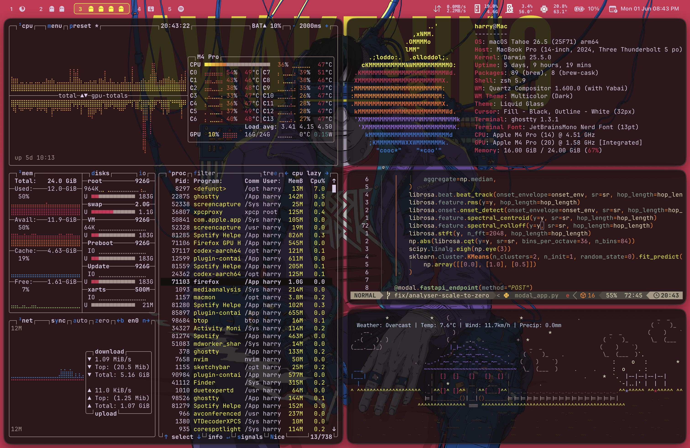
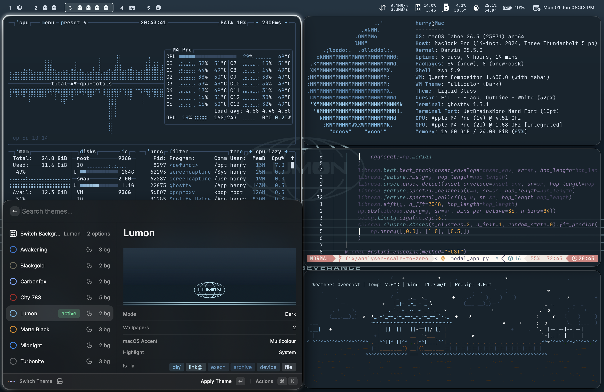

# Macarchy

My macOS desktop setup: yabai, skhd, SketchyBar, Ghostty, Raycast, Neovim, zsh, btop, borders, and a theme switcher that ties the whole thing together.

This is not an installer. It is the dotfiles and scripts for the setup I actually use.

## Preview

<video src="./media/macarchy-preview.mp4" controls muted playsinline></video>




## Components

- `bin/`: `theme-switch` and `set-wallpaper`.
- `themes/`: Macarchy themes, wallpapers, Ghostty palettes, and the active `.current` marker.
- `raycast-theme/`: Raycast extension for switching themes and backgrounds.
- `yabai/`: yabai config and helper scripts for floating state, space swaps, minimised-window restore, and SketchyBar refreshes.
- `skhd/`: key bindings for windows, spaces, screenshots, app control, and theme cycling.
- `sketchybar/`: bar config, items, plugins, and generated theme variables.
- `ghostty/`, `nvim/`, `zsh/`, `btop/`, `fastfetch/`, `neofetch/`, `borders/`, `vim/`: app configs that follow the active theme where relevant.
- `launchagents/`: launchd plists for yabai, skhd, and SketchyBar.
- `media/`: README media only.

## Install

Install the tools:

```bash
brew install btop borders desktoppr fastfetch fish jq neofetch neovim ripgrep sketchybar skhd yabai
brew install --cask ghostty raycast
```

Sync the repo into the locations the scripts expect:

```bash
mkdir -p "$HOME/.local/bin" "$HOME/.config" "$HOME/.config/themes"

rsync -a bin/ "$HOME/.local/bin/"
rsync -a borders/ "$HOME/.config/borders/"
rsync -a btop/ "$HOME/.config/btop/"
rsync -a fastfetch/ "$HOME/.config/fastfetch/"
rsync -a ghostty/ "$HOME/.config/ghostty/"
rsync -a neofetch/ "$HOME/.config/neofetch/"
rsync -a nvim/ "$HOME/.config/nvim/"
rsync -a sketchybar/ "$HOME/.config/sketchybar/"
rsync -a themes/ "$HOME/.config/themes/"
rsync -a zsh/themes/ "$HOME/.config/oh-my-zsh/custom/themes/"
rsync -a yabai/ "$HOME/.config/yabai/"
rsync -a vim/.vimrc "$HOME/.vimrc"
rsync -a skhd/.skhdrc "$HOME/.skhdrc"
```

Copy and load the launch agents:

```bash
mkdir -p "$HOME/Library/LaunchAgents"
rsync -a launchagents/ "$HOME/Library/LaunchAgents/"

launchctl bootstrap "gui/$(id -u)" "$HOME/Library/LaunchAgents/com.asmvik.yabai.plist"
launchctl bootstrap "gui/$(id -u)" "$HOME/Library/LaunchAgents/com.koekeishiya.skhd.plist"
launchctl bootstrap "gui/$(id -u)" "$HOME/Library/LaunchAgents/homebrew.mxcl.sketchybar.plist"
```

If they are already loaded:

```bash
launchctl kickstart -k "gui/$(id -u)/com.asmvik.yabai"
launchctl kickstart -k "gui/$(id -u)/com.koekeishiya.skhd"
launchctl kickstart -k "gui/$(id -u)/homebrew.mxcl.sketchybar"
```

Apply the current theme:

```bash
"$HOME/.local/bin/theme-switch" "$(cat "$HOME/.config/themes/.current")"
```

## Raycast

Install the local Raycast extension:

```bash
mkdir -p "$HOME/.config/raycast/extensions"
rsync -a raycast-theme/ "$HOME/.config/raycast/extensions/theme-switcher/"

cd "$HOME/.config/raycast/extensions/theme-switcher"
ray develop
```

The extension reads themes from `~/.config/themes`, previews the active wallpaper, and calls `~/.local/bin/theme-switch`. The shell script remains the source of truth.

<details>
<summary>SIP and yabai</summary>

This setup assumes Apple Silicon with the `yabai` scripting addition and this boot arg:

```bash
sudo nvram boot-args=-arm64e_preview_abi
```

The working SIP profile is partial SIP with filesystem, debug, and NVRAM protections disabled:

```bash
csrutil enable --without fs --without debug --without nvram
```

A full replication sequence for a new Mac:

1. Boot to Recovery.
2. In Startup Security Utility, choose Reduced Security and allow user management of kernel extensions.
3. In Recovery Terminal:

```bash
csrutil disable
```

4. Reboot to macOS.
5. Set the yabai boot arg:

```bash
sudo nvram boot-args=-arm64e_preview_abi
```

6. Reboot to Recovery.
7. Re-enable the intended partial SIP profile:

```bash
csrutil enable --without fs --without debug --without nvram
```

8. Reboot to macOS.

`csrutil status` will show `unknown (Custom Configuration)`. That is expected for this profile.

</details>
