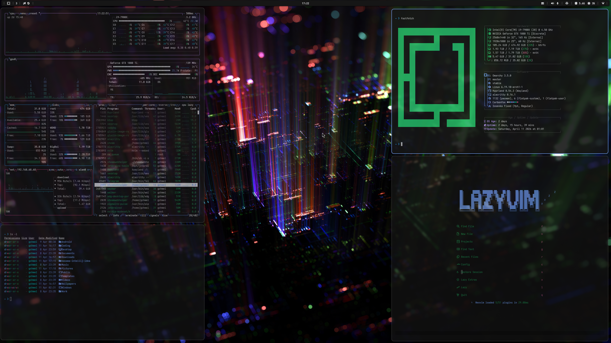

# Carbonfox Theme for Omarchy



This is a custom theme for Omarchy called "Carbonfox". It features a sleek and modern design with a dark color scheme inspired by the Carbon design system.

Heavily inspired by Carbon Design from IBM, and original carbonfox theme from [nightfox.nvim](https://github.com/EdenEast/nightfox.nvim) by James Simpson.

## Installation

To install the Carbonfox theme for Omarchy, follow these steps:
```bash omarchy-theme-install https://github.com/gchmel/carbonfox.git```
